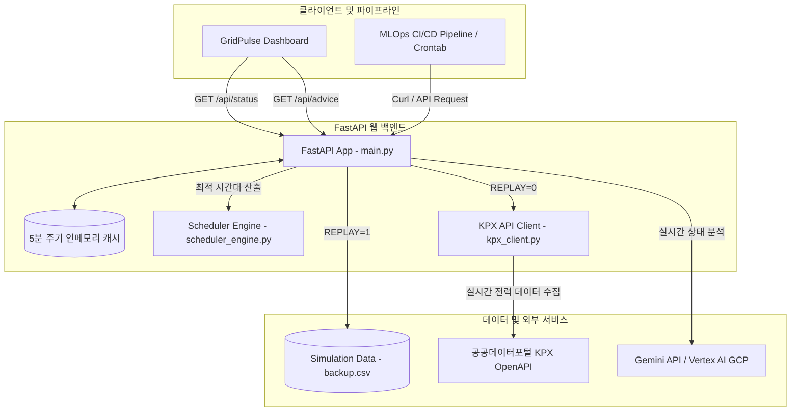

# 🍃 GridPulse — Carbon-Aware AI Workload Scheduler

> **한국 전력망 실시간 수급 및 발전 믹스 기반의 친환경·비용 최적화 AI 워크로드 스케줄러**
>
> GridPulse는 데이터센터 및 클라우드 환경에서 고성능 연산(GPU 학습, 대용량 배치 연산 등)을 수행하는 개발자와 MLOps 엔지니어를 위해 대한민국 전력 거래소(KPX)의 실시간 수급 현황과 탄소집약도를 분석하고, 최신 Gemini 3.5 Flash 모델 및 특화 스케줄링 알고리즘을 결합하여 가동 시점의 이득(탄소 절감 및 전기 요금 할인)을 극대화하는 지능형 스케줄러입니다.

---

## 📌 주요 특징 (Key Features)

* **실시간 대한민국 전력망 분석 (Live KPX Grid Monitoring)**
  * 공공데이터포털 연동을 통해 실시간 전력 공급 능력, 부하량, 예비율을 수집합니다.
  * 수력, 석탄, 원자력, 가스, 신재생, 태양광 등 실시간 발전 믹스 데이터를 동적으로 파싱합니다.
* **그리드 탄소 집약도 산출 (Carbon Intensity Calculation)**
  * IPCC AR5 생애주기 이산화탄소 배출 계수(Lifecycle CO2 Emission Factors)를 활용하여 현재 전력망의 탄소집약도(gCO2eq/kWh)를 소수점 단위로 정밀 산출합니다.
  * 전력망 스트레스 레벨에 기반한 정부 전력 수급 비상단계를 준용한 안전 지표를 도출합니다.
* **GenAI 기반 지능형 실행 가이드 (Gemini AI Power Advisor)**
  * 최신 공식 `google-genai` SDK를 활용하여 실시간 전력 상태에 대응하는 최적의 AI 워크로드 행동 지침(GPU 대규모 학습, ETL 파이프라인, 서빙 스케일러 등)과 실행 판정(즉시 실행 vs 지연 실행)을 자동으로 제안합니다.
  * API Key를 통한 다이렉트 호출뿐만 아니라, GCP Service Account의 ADC(Application Default Credentials) 기반 Vertex AI 연동을 매끄럽게 지원합니다.
* **시간대별 스케줄링 엔진 알고리즘 (Tariff & Carbon Aware Scheduler)**
  * 산업용 전력 시간대별 요금 가중치(경부하, 중부하, 최대부하) 및 시간대별 탄소 절감 계수 프로필을 시계열로 추적합니다.
  * 요구 가동 시간(Duration)을 입력받아, 향후 24시간 내 가장 ESG 종합 점수가 높고 전력 요금이 저렴하며 전력망이 안정적인 최적 가동 시작 시간대 Top 3를 제안합니다.
* **시뮬레이션 및 오프라인 모드 (Replay Mode)**
  * 공공데이터 API 인증 키가 없거나 오프라인 환경에서도 작동할 수 있도록, 실제 24시간 전력망 흐름이 기록된 `backup.csv` 데이터를 통해 가상 루프를 돌 수 있는 완전한 재현 모드(`REPLAY=1`)를 탑재하고 있습니다.
* **프리미엄 대시보드 (Premium Glassmorphism UI)**
  * 현대적인 글래스모피즘(Glassmorphism) 스타일과 인터랙티브 차트(Chart.js)를 채택하여, 실시간 수급 상황, 발전 믹스 비중, 탄소 집약도 추이를 가시화합니다.
  * MLOps 파이프라인 및 개발자를 위한 Bash(curl), Python API 연동 코드 가이드를 내장하고 있어 현업에 쉽게 연동이 가능합니다.

---

## 🛠️ 시스템 아키텍처 (Architecture)



---

## 🗂️ 프로젝트 디렉토리 구조 (Directory Structure)

```text
├── main.py                  # FastAPI 기반 웹 백엔드 & API 라우터 (Entrypoint)
├── scheduler_engine.py      # 대한민국 표준 산업용 요금제 및 탄소 배출 기준 시계열 스케줄 추천 알고리즘
├── kpx_client.py            # 한국전력거래소 실시간 전력 수급 API 통신 클라이언트
├── backup.csv               # 24시간 분량의 전력망 시뮬레이션 및 리플레이용 백업 데이터셋
├── requirements.txt         # 파이썬 종속성 패키지 목록
├── Dockerfile               # Cloud Run 등 가상화 배포를 위한 도커 설정 파일
├── .env.example             # 환경변수 및 공공데이터포털 API 키 템플릿
└── static/                  # 프론트엔드 정적 파일 저장소
    ├── index.html           # 대시보드 메인 레이아웃 및 개발자 가이드 UI
    ├── style.css            # 세련된 다크모드/글래스모피즘 CSS 스타일시트
    └── app.js               # 백엔드 API 연동, Gauges 제어 및 Chart.js 그래프 구동 스크립트
```

---

## ⚙️ 개발 환경 설정 및 실행 방법 (Quick Start)

### 1. 환경 변수 구성
프로젝트 루트 폴더에 `.env` 파일을 생성하고 아래 형식을 참고하여 설정합니다. 

```bash
# .env.example 복사하여 사용 가능
cp .env.example .env
```

```ini
# 공공데이터포털에서 발급받은 KPX API 인코딩 키를 입력합니다.
KPX_CURRENT_POWER_STATUS_GW_ENCODING_KEY=YOUR_ENCODING_KEY
KPX_GEN_MIX_ENCODING_KEY=YOUR_ENCODING_KEY

# Gemini AI 권고 활성화를 위한 설정
GEMINI_API_KEY=YOUR_GEMINI_API_KEY

# Replay 시뮬레이션 모드 활성화 여부 (1: 시뮬레이션 모드 활성화 / 0: 공공데이터 실시간 OpenAPI 연동)
REPLAY=1
```

> [!NOTE]
> `REPLAY=1`인 상태에서는 API 키나 별도의 인증 없이도 `backup.csv`를 읽어 24시간 전력 흐름을 실감 나게 구동 및 테스트할 수 있습니다. 

---

### 2. 로컬 실행 방법

**필요 조건:** Python 3.12 이상

```bash
# 1. 패키지 설치
pip install -r requirements.txt

# 2. FastAPI 서버 기동
uvicorn main:app --host 0.0.0.0 --port 8000 --reload
```

서버가 가동되면 브라우저에서 [http://localhost:8000](http://localhost:8000)으로 접속하여 프리미엄 대시보드를 확인할 수 있습니다.

---

### 3. Docker 배포 및 구동 방법

서버리스 환경(Google Cloud Run 등)에 단일 컨테이너로 손쉽게 배포할 수 있습니다.

```bash
# 1. 도커 이미지 빌드
docker build -t gridpulse:latest .

# 2. 컨테이너 로컬 실행
docker run -d -p 8080:8080 --env-file .env gridpulse:latest
```

---

## 🔌 API 명세서 (API Endpoints)

### 1. 실시간 전력 및 탄소 상태 조회
* **Endpoint:** `GET /api/status`
* **Query Parameters:** `force_refresh: bool` (인메모리 캐시를 무시하고 실시간 API 즉시 강제 갱신)
* **Response 예시:**
```json
{
  "success": true,
  "mode": "replay",
  "hour": 12,
  "data": {
    "base_datetime": "20260716120000",
    "current_load_mw": 72500.0,
    "supply_ability_mw": 85000.0,
    "supply_reserve_mw": 12500.0,
    "supply_reserve_rate": 17.24,
    "operational_reserve_mw": 8200.0,
    "operational_reserve_rate": 11.31,
    "forecast_load_mw": 74000.0
  },
  "generation_mix": {
    "hydro": 450.0,
    "oil": 200.0,
    "coal_bituminous": 21000.0,
    "nuclear": 18000.0,
    "pumped": 500.0,
    "gas_lng": 15000.0,
    "coal_domestic": 150.0,
    "renewable": 4200.0,
    "solar": 6500.0
  },
  "carbon_intensity": 412.5,
  "grid_stress_level": "여유",
  "grid_stress_color": "GREEN"
}
```

---

### 2. Gemini AI 스케줄 및 액션 플랜 권고
* **Endpoint:** `GET /api/advice`
* **Response 예시:**
```json
{
  "grid_stress": "여유",
  "carbon_window": "green",
  "recommendation": "RUN_NOW",
  "defer_until_hint": "GPU 대규모 연산 즉시 시작 적극 권장",
  "reasoning": "현재 공급 예비율이 17% 이상 확보되었으며, 청정 신재생 및 태양광 발전량이 급증하여 탄소 집약도가 일간 최저 수준인 412.5 gCO2eq/kWh를 기록하고 있습니다. 친환경 고성능 연산을 시작하기 가장 최적의 타이밍입니다.",
  "actions": [
    "미뤄둔 GPU 대규모 분산 학습 및 LLM 파인튜닝 컨테이너를 즉시 실행합니다.",
    "탄소 소모가 극소화된 틈을 타 MLOps 배치 파이프라인 및 데이터 전처리를 최대로 병렬 가동합니다.",
    "클라우드 인스턴스의 전력 제한을 해제하고 최대 클럭으로 훈련 속도를 끌어올리십시오."
  ],
  "estimated_saving": "최대 48.0% 전력 요금 및 탄소 배출 동시 절감"
}
```

---

## 🤖 MLOps 파이프라인 연동 예시 (Integration Guide)

GridPulse의 API를 CI/CD 파이프라인이나 스크립트 스케줄러에 연동하면 탄소 배출과 인프라 비용을 대폭 아낄 수 있습니다.

### Bash / Shell 스크립트 연동 예시 (crontab 등 활용)
```bash
#!/bin/bash

# 1. GridPulse API로부터 실행 판정 획득
RECOMMENDATION=$(curl -s http://localhost:8000/api/advice | jq -r .recommendation)

if [ "$RECOMMENDATION" = "RUN_NOW" ]; then
  echo "✅ [GridPulse] 저탄소·친환경 시간대 판정 - 대규모 GPU 훈련 가동 시작!"
  # 실제 학습 컨테이너 또는 스크립트 구동 명령 작성
  python train_model.py
else
  DEFER_TIME=$(curl -s http://localhost:8000/api/advice | jq -r .defer_until_hint)
  echo "⚠️ [GridPulse] 고부하 및 고탄소 발전 시간대 감지 - 기동이 보류되었습니다."
  echo "💡 가이드: $DEFER_TIME"
fi
```

### Python API 연동 예시
```python
import urllib.request
import json
import time

def check_green_window():
    url = "http://localhost:8000/api/advice"
    req = urllib.request.Request(url, headers={'User-Agent': 'GridPulse-Agent'})
    
    try:
        with urllib.request.urlopen(req, timeout=5) as response:
            res = json.loads(response.read().decode('utf-8'))
            return res
    except Exception as e:
        # API 통신 실패 시 무중단 비즈니스 지속을 위한 기본값(폴백) 제공
        print(f"⚠️ API 장애 발생, 기본 모드로 가동을 허용합니다: {e}")
        return {"recommendation": "RUN_NOW", "defer_until_hint": "즉시 실행"}

def main():
    advice = check_green_window()
    print(f"🌲 GridPulse 판정: {advice.get('recommendation')}")
    print(f"💡 근거 요약: {advice.get('reasoning')}")
    
    if advice.get("recommendation") == "RUN_NOW":
        print("🚀 GPU 인프라 전력 한도 최대로 활성화 및 학습 작업 기동...")
    else:
        print(f"💤 큐에서 대기합니다. 다음 권장 가동 시간: {advice.get('defer_until_hint')}")

if __name__ == "__main__":
    main()
```

---

## 📊 탄소 집약도 배출 계수 기준 (Carbon Lifecycle Reference)

GridPulse는 전 세계적인 표준인 **IPCC AR5 (기후변화에 관한 정부간 협의체 제5차 보고서)의 생애주기 온실가스 배출량 중간값**을 적용하여 대한민국의 전력망 탄소집약도를 정확히 시뮬레이션합니다.

| 발전원 종류 (Generation Source) | CO₂ Lifecycle 배출 계수 (gCO₂eq/kWh) |
| :--- | :---: |
| **원자력 (Nuclear)** | `12` |
| **수력 (Hydro)** | `24` |
| **양수 (Pumped storage)** | `24` |
| **신재생/풍력 등 (Renewables)** | `38` |
| **태양광 (Solar)** | `45` |
| **가스/LNG (Gas)** | `490` |
| **유류 (Oil)** | `700` |
| **유연탄 (Coal - Bituminous)** | `820` |
| **국내탄 (Coal - Domestic)** | `820` |

---

## 📄 라이선스 (License)

This project is licensed under the MIT License.
GridPulse를 활용하여 탄소 배출량을 감소시키고, 더 푸르고 친환경적인 인공지능 연구 생태계를 만들어가세요! 🌲
